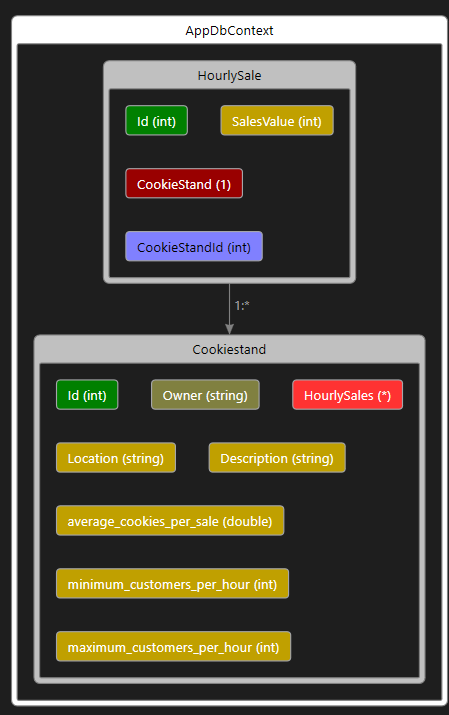

# Pat's Salmon Cookie Stand Application

Welcome to Pat's Salmon Cookie Stand Application! This application helps Pat manage and track the performance of various cookie stands in different locations.

## Overview

Pat's Salmon Cookie Stand Application is designed to provide a platform for managing cookie stands. The application allows Pat to perform CRUD (Create, Read, Update, Delete) operations on cookie stands and view sales data.

## Features

- Create new cookie stands with location details.
- Update existing cookie stands.
- Delete cookie stands.
- View a list of all cookie stands.

## Technologies Used

- ASP.NET Core (Web API)
- Entity Framework Core
- Azure (for hosting web app and database)
- C# programming language

## API Endpoints
The API provides the following endpoints:

POST: /api/cookiestand: Create a new cookie stand.

GET: /api/cookiestands: Retrieve a list of all cookie stands.

GET: /api/cookiestand/{id}: Retrieve a specific cookie stand by ID.

PUT: /api/cookiestand/{id}: Update an existing cookie stand by ID.

DELETE: /api/cookiestand/{id}: Delete a cookie stand by ID.

## Contributing
Contributions are welcome! If you'd like to contribute to this project, please follow these steps:

Fork the repository.
Create a new branch for your feature or bug fix.
Make your changes and commit them.
Push your changes to your fork.
Create a pull request to merge your changes into the main repository.
